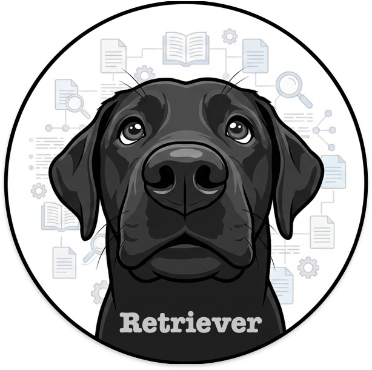

<p align="center">
  
</p>

<p align="center">
  <strong>AI-powered Q&A for your organization's documents</strong>
</p>

<p align="center">
  <a href="#features">Features</a> •
  <a href="#quick-start">Quick Start</a> •
  <a href="#configuration">Configuration</a> •
  <a href="#deployment">Deployment</a> •
  <a href="#documentation">Documentation</a>
</p>

# Retriever: AI-Powered Document Q&A with RAG

Retriever is an open-source retrieval-augmented generation (RAG) system for document question-answering. It indexes an organization's PDFs, Word documents, spreadsheets, and web pages, then answers natural-language questions with cited sources. Built by [Chris Krough](https://dev.krough.org) under [Backchain](https://backchain.ai).

Retriever is an AI-powered question-answering system that helps users find information in your organization's policy and procedure documents. Upload your documents, and Retriever uses RAG (Retrieval-Augmented Generation) to provide accurate, sourced answers.

Retriever can be adapted for any organization with documentation that users need to search.

## Features

- **Natural Language Q&A** — Ask questions in plain English and get accurate answers with source citations
- **Multi-Document Support** — Index multiple markdown and text documents
- **Source Citations** — Every answer includes clickable citations to the original documents
- **Conversation History** — Continue conversations with context from previous questions
- **Hybrid Search** — Combines semantic understanding with keyword matching for better retrieval
- **Content Safety** — Built-in moderation and hallucination detection
- **User Authentication** — Secure login system with JWT tokens
- **Semantic Caching** — Faster responses for similar questions
- **Rate Limiting** — Prevent abuse with configurable request limits

## Quick Start

### Prerequisites

- Python 3.13+ with [uv](https://docs.astral.sh/uv/)
- Docker
- [Supabase CLI](https://supabase.com/docs/guides/cli)
- An LLM gateway token: chat, embeddings, and moderation route through one OpenAI-compatible gateway (Cloudflare AI Gateway by default), which holds the provider keys (BYOK)

### Get Running

```bash
git clone https://github.com/ckrough/retriever.git
cd retriever
cp .env.example .env
# Edit .env with your API keys

supabase start                    # Auth + Supabase services
docker compose up -d              # pgvector postgres + jaeger

cd backend && uv sync --dev
uv run alembic upgrade head
uv run uvicorn retriever.main:app --reload --port 8000
```

Backend API: [http://localhost:8000/docs](http://localhost:8000/docs). The frontend portal lives in the separate [stacker](https://github.com/ckrough/stacker) repository.

See [CONTRIBUTING.md](CONTRIBUTING.md) for full development setup, quality checks, and workflow.

## Usage

### Web Interface

1. **Login** — Create an account or log in at `/login`
2. **Ask Questions** — Type your question in the chat interface
3. **View Sources** — Click citation cards to see the original document text
4. **Continue Conversations** — Ask follow-up questions with context preserved

### API

Retriever exposes a REST API for programmatic access:

```bash
# Ask a question
curl -X POST http://localhost:8000/api/v1/rag/ask \
  -H "Content-Type: application/json" \
  -H "Authorization: Bearer YOUR_TOKEN" \
  -d '{"question": "What is the check-in procedure?"}'
```

API documentation is available at `/docs` (OpenAPI/Swagger).

## Configuration

See `.env.example` for all configuration options. LLM access:

| Variable | Description |
|----------|-------------|
| `LLM_GATEWAY_TOKEN` | Single BYOK token for the OpenAI-compatible LLM gateway (chat, embeddings, moderation), the only LLM secret the app needs. With Cloudflare, also set `CLOUDFLARE_ACCOUNT_ID` and `CLOUDFLARE_GATEWAY_ID` to derive the gateway URL. |
| `LLM_GATEWAY_URL` | Optional override pointing at any OpenAI-compatible gateway instead of the Cloudflare default. |

The gateway is required: all outbound model calls route through it, and the app fails fast at startup if no gateway is configured. Provider keys (OpenAI, Anthropic) live in the gateway (BYOK), not in app config.

Auth is handled by Supabase (local via `supabase start`, production via Supabase project). See [CONTRIBUTING.md](CONTRIBUTING.md) for full environment setup.

### Document Preparation

For best results:

- Use **markdown format** with clear headings (`#`, `##`, `###`)
- Keep sections focused on single topics
- Use descriptive headings that match how users ask questions
- Include relevant keywords naturally in the text

## Deployment

- **Backend:** Cloud Run via `gcloud run deploy --source ./backend`
- **Database:** Supabase (managed Postgres + pgvector)
- **Frontend:** deployed from the [stacker](https://github.com/ckrough/stacker) repository (Cloudflare Pages)

### Production Checklist

- [ ] Set `DEBUG=false`
- [ ] Configure Supabase project with RLS policies
- [ ] Set up Cloudflare AI Gateway for LLM routing
- [ ] Configure OpenTelemetry (GCP Cloud Trace or OTLP endpoint)
- [ ] Enable Langfuse for LLM observability (optional)
- [ ] HTTPS handled by Cloud Run / Cloudflare Pages

## Architecture

```
┌─────────────────────────────────────────────────────────────┐
│                    DOCUMENT PIPELINE                         │
│  [Markdown/Text] → [Chunker] → [Embeddings] → [pgvector]     │
└─────────────────────────────────────────────────────────────┘
                                                    ↓
┌─────────────────────────────────────────────────────────────┐
│                      QUERY FLOW                              │
│  [Question] → [Hybrid Search] → [Rerank] → [LLM] → [Answer]  │
└─────────────────────────────────────────────────────────────┘
```

**Tech Stack:**
- **Backend:** Python 3.13+, FastAPI, SQLAlchemy 2.0 async, Pydantic 2.x
- **LLM:** One OpenAI-compatible LLM gateway (Cloudflare AI Gateway by default), `OpenAICompatProvider` for chat
- **Vector DB:** Supabase Postgres + pgvector (HNSW cosine + GIN full-text)
- **Auth:** Supabase Auth / JWKS
- **Observability:** structlog + OpenTelemetry + Langfuse
- **Deploy:** Cloud Run (backend)
- **Frontend:** [stacker](https://github.com/ckrough/stacker) (separate repo): SvelteKit + Svelte 5 runes + Skeleton UI v4

## Development

See [CONTRIBUTING.md](CONTRIBUTING.md) for full setup and quality check commands.

## Documentation

- [Architecture Overview](docs/architecture.md)
- [Development Standards](docs/development-standards.md)
- [Implementation Roadmap](docs/increments.md)
- [Deployment Guide](docs/guides/deployment.md)
- [Adding Documents](docs/guides/adding-documents.md)

## License

Apache License 2.0 (Apache-2.0). See [LICENSE](LICENSE) for the full text and [NOTICE](NOTICE) for attribution.

Copyright (C) 2025 Backchain LLC

## About / Built by

I'm [Chris Krough](https://dev.krough.org), and I build production AI systems like this one. Retriever is the kind of work I do: retrieval pipelines, LLM safety, and observability shipped as real, deployable software. Find me on [my site](https://dev.krough.org) and [LinkedIn](https://linkedin.com/in/ckrough).

Retriever is developed and maintained under [Backchain](https://backchain.ai), my AI transformation consulting practice. Backchain helps organizations discover where AI works: [Discover Where AI Works](https://backchain.ai).

If Retriever is useful to you, star the repo and reach out. I'm open to collaboration, consulting, and conversations about applied AI.
